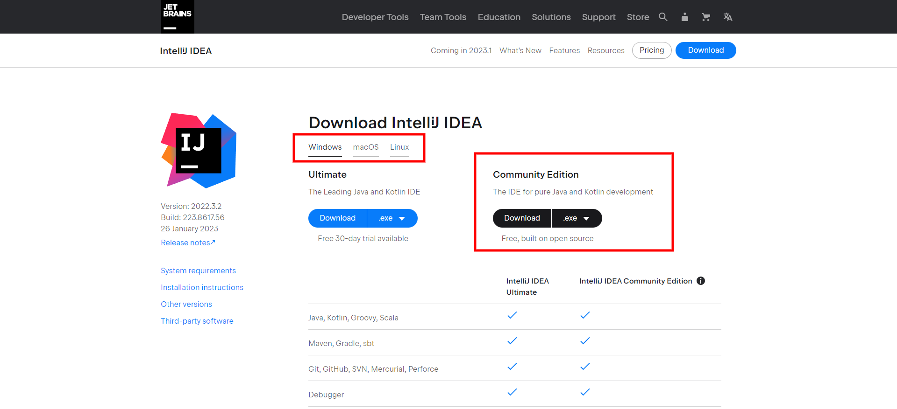
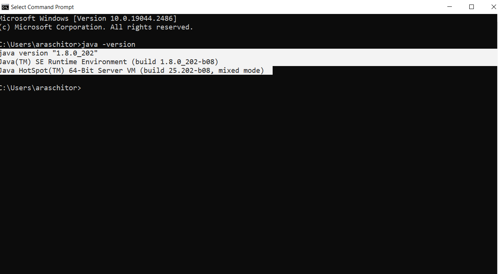
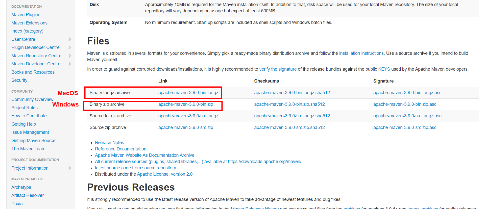

`Test Environment Setup`

In order to run a simple test, you need to have installed on your local computer the followings:

 - IntelliJ Community Edition
   - 
    1. Go to https://www.jetbrains.com/idea/download/
    
    2. Download IntelliJ and install it

  - Java JDK 8
    -
    1. Go to Oracle downloads https://www.oracle.com/java/technologies/javase/javase8-archive-downloads.html
    2. 
    3. Download JDK accordingly with your local OS **_(windows/macOS)_**
    4. Make your Oracle account
    5. Install JDK 
    6. Check Java version in terminal/cmd **_java -version_**
      - 
    7. Set java home as system variable
        - open your terminal/cmd
          - **WINDOWS**: setx JAVA_HOME "local/path/to/your/java/jdk"
            - e.g. of local JDK path _**C:\Program Files\Java\jdk1.8.0_202**_
          - **MacOS**: export JAVA_HOME=/Library/Java/JavaVirtualMachines/jdk1.8.xx/Contents/Home
          - Following message should appear in cmd/terminal _SUCCESS: Specified value was saved_

  - Maven
    - 
    1. Go to Maven Apache downloads https://maven.apache.org/download.cgi
    2. Download maven accordingly with your OS
        
    3. Unzip maven to your local computer
    4. Check maven version in terminal/cmd **mvn -v**
       
     5. Set maven home as a system variable
         - open your terminal/cmd
             - **WINDOWS**: setx MAVEN_HOME "local/path/to/your/maven"
                 - e.g. of local JDK path _**C:\apache-maven-3.8.6**_
             - **MacOS**: export MAVEN_HOME="/Users/johndoe/Development/apache-maven-3.8.6"
             - Following message should appear in cmd/terminal _SUCCESS: Specified value was saved_
    - Run tests
      - 
    - Open **src/test/java/LoginTests.java** file and follow the instruction